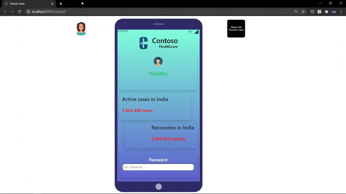
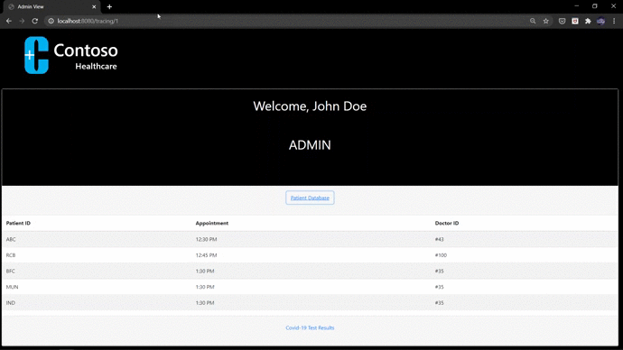
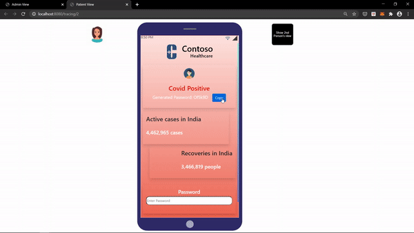
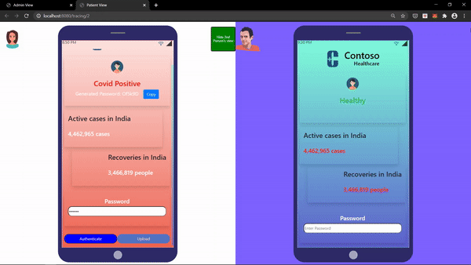
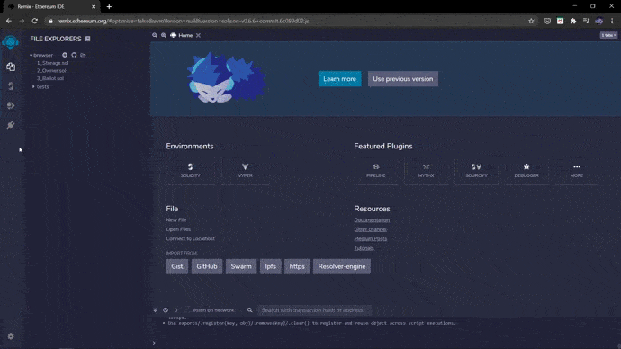
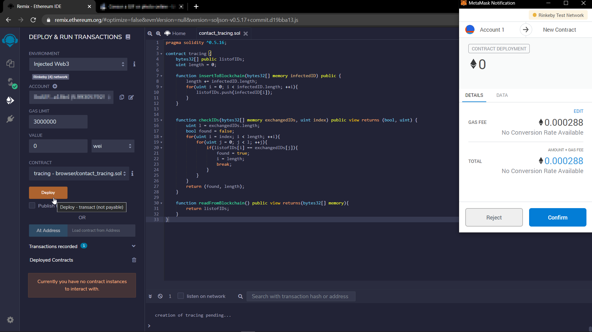

[![LinkedIn][linkedin-shield]][linkedin-url]

# Hospital Of The Future - Digital Contact Tracing

<br />
<p align="center">
  <a href="https://github.com/github_username/repo_name">
    
  </a>

  <h3 align="center">BLOCKCHAIN ENABLED CONTACT TRACING</h3>
  <br />

  <p align="center">
    2020. The year we were hit with a pandemic that no one saw coming. Like the age old adage goes, 'Prevention is better than cure'. With this in mind, our project is a PoC that aims to make a decentralised, privacy-preserving contact tracing system. 
  </p>
</p>

<br>

# Table of Contents

* [About the Project](#about-the-project)
* [Workflow](#Workflow)  
* [Getting Started](#getting-started)
  * [Prerequisites](#prerequisites)
  * [Installation](#installation)
* [Usage](#usage)
  * [Obtaining Test Ether](#Obtaining-Test-Ether)
  * [Running The App](#Running-The-App)
* [Hosting Your Own Blockchain](#Hosting-your-own-blockchain)
  * [Deploying using Remix IDE](#Deploying-using-Remix-IDE)
  * [Verifying your Smart Contract](#Verifying-your-Smart-Contract)
* [Eventual Impact](#eventual-impact)
* [Contact](#contact)

<br>

# About The Project
In times of a pandemic like Covid-19, it is crucial that an **effective contact tracing** solution be in place so that we can directly reduce the number of infected people, and thereby saving lives. **Effective contact tracing** implies both that the data is accurate and reliable **and** there is a high percentage of adoption by the public.  

Despite a plethora of existing digital contact tracing solutions, the problems that plague it include:

* Data collection is not minimised.
* Centralised storage of data.
* Lack of transparency about who can access this data.
* It is limited to geographic entities such as nations. A pandemic makes no such discrimination. 

The impact of such policies has been that adoption rates are as low as **10%-15%** of the population. 

This project is a proof of concept of how Blockchain can be used in Contact Tracing, and influence the uptake of digital contact tracing solutions.


**Hospital View**


<br>


**Patient View**



<br>

# Workflow


* Each user has an application running in the background on their phone. The application generates **Bluetooth IDs**.

* Whenever 2 devices come in contact, these IDs are exchanged. 

* Patients who are sick or experience symptoms visit the hospital for diagnosis. 

<br>

 

<br>

* The hospital admin generates a password for those patients whose test result is positive. 

* Patients with the password have the option to upload their data on the blockchain. 

* The applications on the other users' phones constantly check the blockchain to see if a Bluetooth ID that they have received is uploaded to the blockchain. 

* If a match is found, then an alert is sent to the user. 


<br>

# Getting Started

## Prerequisites


**If you're installing npm or node for the first time:** <br>
Visit <a href = "https://nodejs.org/en/download/">this link </a> to download node. Node Packet Manager (npm) is downloaded as well. 


Run the following commands to update/install the necessary modules such as npm, node, web3 etc.
(Note that the node downloaded here will not be available globally)
```sh
npm install npm@latest -g
npm install node@10.15.0 
npm install web3 
npm install express cheerio got
```

### Metamask 
You need to have a browser extension called **Metamask** installed. This is to interact with the hosted blockchain. You can download it from the following link:
<br>

<a href = "https://metamask.io/">Download Metamask</a>


## Installation

Clone the repo in your desired folder.
```sh
git clone https://github.com/github_username/repo_name.git
```
<br>

# Usage
* Installing Metamask prompts you to create a user account. Create a user account, and keep your password and user ID safe. 

## Obtaining Test Ether
The blockchain smart contract is deployed on the Rinkeby Testnet. You will be interacting with the existing smart contract, and for that you need some test ether. The following steps will tell you how to obtain test ether: 
  * Click on the Metamask extension. Copy the 'address'(it's a reference to your Ethereum address)
  * Copy this address given there and make a post on either twitter or facebook. 
  > **DISCLAIMER:** <br> The address is meant to identify you in a public way, so there is no security threat posed by making a post. However, it may allow people who know you to associate you with the address and remove the element of anonymity. 

  * Copy the link of the post and paste it <a href = "https://faucet.rinkeby.io/" target = "_blank">here</a>.
  * Request for 3 ether in 8 hours (as it's the fastest, and sufficient).
  * In your Metamask wallet, you should be see 3 ether deposited in your account. 
  > **NOTE:** <br> The ether you receive is test ether and has no monetary value. 

## Running The App
* Enter the directory where the repo exists. Open the terminal/command prompt in that folder. 
* Enter the following command: 
```sh
node server.js
```
* Now, the server is running, and listening on port 8080. You can change it to any port of your choice. 
On the browser, run:
```sh
http://localhost:8080/tracing/1
http://localhost:8080/tracing/2
```
The page called tracing1.html is the hospital "Admin View", and tracing2.html is the "Patient View". 
* Click on "Generate Password" on the "Admin Page". This takes you to the patient persona, where the patient is notified to be unwell.

<br>



<br>


* Authenticate the password. Upload the data onto the blockchain using the 'Upload' button. 
* Clicking on the 'Upload' button opens up a Metamask windows asking you to confirm the transaction. Click on 'Confirm'.

<br>



<br>

* On the alternate phone, you will be seeing a notification saying the 2nd person has been infected.

<br>



<br>

> **VIEWING THE TRANSACTIONS:** <br> You can click on the following link to view all transactions that have been made since the creation of the contract. The link will also include all the transactions that other users of the "tracing.sol" Smart Contract that is hosted in this repository. <br>
<a href = "https://rinkeby.etherscan.io/address/0xb7eeEDe8968646A791198fb7169Ef9a9964721B3" target = "_blank"> View Transactions <a>

<br>

# Hosting Your Own Blockchain
In this project you interacted with a smart contract hosted on the Rinkeby Test Network. This section is so that you can edit the "tracing.sol" file (i.e. the smart contract of this Contact Tracing solution) and host it on a Test Network yourself. 

## Deploying using Remix IDE
> Having a Metamask account with balance is **necessary**. 

* <a href = "">This link (to Remix online IDE)</a> redirects you to online IDE Remix. On the 'File Explorers' Pane, click on the '+' symbol to create a new file. Name it, and copy the contents from the "tracing.sol" in this repo to the online IDE. 

* After making the necessary edits, on the left-hand pane, click on the 'Solidity Compiler' button. 


* Click on the 'Compile' button to compile the file. 


>NOTE: <br> You can interact with the functions that you have created right in the Remix IDE, after compilation. You will see an interface to interact with your Smart Contract on the left hand pane.  


* To deploy the smart contract, on the left-hand pane, click on the 'Deploy & run transactions' option. Click on the 'Injected Web3' option as shown below, and enter your Metamask password. 

<br>



<br>

* After you enter your password, your account number will appear in the account tab. The 'Deploy' button will be enabled below. 


* Clicking on deploy will show up a confirmation on Metamask. Once you click on 'Confirm', the contract will be deployed. 

<br>



<br>

* You will find the address at which the contract can be found after deployment. 


## Verifying your Smart Contract

* Click on <a>this link</a> to go to Etherscan. This is what allows you to see your deployed Smart Contract, and all it's transactions. As the Smart Contract has not yet been verified you will not be able to find it. 

* On Etherscan, enter your public Etheruem address found on Metamask. Find the transaction that deployed the contract (the transaction number is a hash number). 

* There is a 'Verify and Publish' button in the 'Code' tab. Click it. 

* Copy and paste the solidity code exactly as it is written. 

* Fill in the name of the parent contract for contract name, and specify the compiler that was used. We did not add any libraries so we can scroll to the bottom and verify.

* After a successful verification, you can see the Smart Contract Address. 

* Copy the address and change the value of this address in the files 'index3.js' and 'index4.js' in the 'static' folder. Now, the phones are interacting with this new blockchain. 

* You can also use this address for a dApp that you develop independently. 

<br>


# Eventual Impact

In scientific terminology, a "case" is a person who is confirmed to have a disease. When we're talking about a disease like CoVid-19, a "contact" is that person who has been in contact for at least 15 minutes, at a distance of approximately around 6 feet or lesser from a case. Contact Tracing is how we trace contacts, and provide an early warning, so that they don't pass on the infection. For a disease with an exponential rise of a quadratic nature, if we can prevent just one infection per person, we are transforming an exponential rise to a linear rise. 

Let's take the example of Alice, and assume she has been infected with CoVid. She spreads the disease to 2 people, and they spread it to 2 more people. For the sake of simplicity, let's say they spread it only once, and each person who contracts the disease spreads to 2 more people the next day. **After just 10 days, a MASSIVE 1024 people would be infected!** In the same scenario, if each person spreads it to 1 person as opposed to 2 people, after 10 days, the number of infected people will be as LOW as **10 people (relatively much lower)**. 

Digital Contact Tracing is what enables this to be possible. It is reliant and at least as accurate as traditional tracing. Using technology such as blockchain increases trust in users, ultimately leading to a much higher adoption rate. This is extremely relevant today, as for digital tracing to work, adoption rates must be much higher than the current rates.  

Ultimately, an effective, trustworthy Digital Contact Tracing solution such as the proposed solutions has an immediate impact in terms of saving lives now, and in the future as well. 

<br>

# Contact

Anind Kiran  - anindk1999@hotmail.com


[linkedin-shield]: https://img.shields.io/badge/-LinkedIn-black.svg?style=flat-square&logo=linkedin&colorB=555
[linkedin-url]: https://www.linkedin.com/in/anind-k-621447197/

