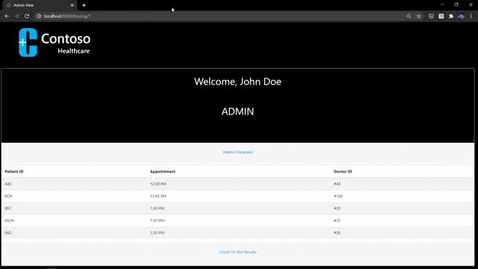
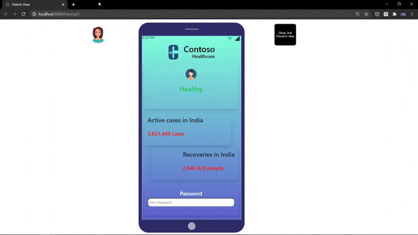
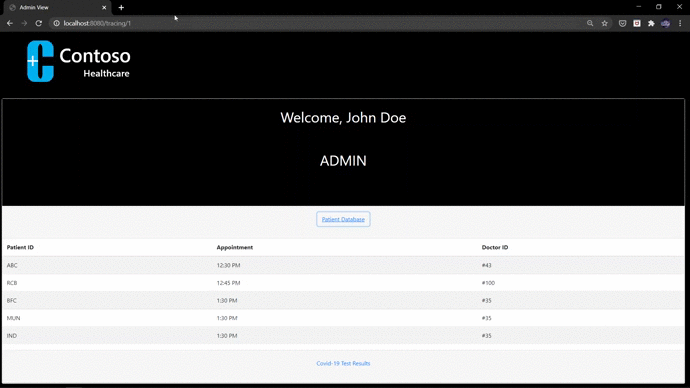

<!-- PROJECT SHIELDS -->
<!--
*** I'm using markdown "reference style" links for readability.
*** Reference links are enclosed in brackets [ ] instead of parentheses ( ).
*** See the bottom of this document for the declaration of the reference variables
*** for contributors-url, forks-url, etc. This is an optional, concise syntax you may use.
*** https://www.markdownguide.org/basic-syntax/#reference-style-links
-->
[![LinkedIn][linkedin-shield]][linkedin-url]


<!-- PROJECT LOGO -->
<br />
<p align="center">
  <a href="https://github.com/github_username/repo_name">
    
  </a>

  <h3 align="center">BLOCKCHAIN ENABLED CONTACT TRACING</h3>
  <br />

  <p align="center">
    2020. The year we were hit with a pandemic that no one saw coming. Like the age old adage goes, 'Prevention is better than cure'. With this in mind, our project is a PoC that aims to make a decentralised, privacy-preserving contact tracing system. 
    <br />
    <!-- <a href="https://github.com/github_username/repo_name"><strong>Explore the docs »</strong></a> -->
    <br />
    <!-- <a href="https://github.com/github_username/repo_name">View Demo</a> -->
    ·
    <a href="https://github.com/github_username/repo_name/issues">Report Bug</a>
    ·
    <a href="https://github.com/github_username/repo_name/issues">Request Feature</a>
  </p>
</p>


<!-- TABLE OF CONTENTS -->
## Table of Contents

* [About the Project](#about-the-project)
* [Workflow](#Workflow)  
* [Getting Started](#getting-started)
  * [Prerequisites](#prerequisites)
  * [Installation](#installation)
* [Usage](#usage)
* [Contact](#contact)
* [Acknowledgements](#acknowledgements)


<!-- ABOUT THE PROJECT -->
## About The Project
In times of a pandemic like Covid-19, it is crucial that an **effective contact tracing** solution be in place so that we can directly reduce the number of infected people, and thereby saving lives. **Effective contact tracing** implies both that the data is accurate and reliable **and** there is a high percentage of adoption by the public.  

Despite a plethora of existing digital contact tracing solutions, the problems that plague it include:

* Data collection is not minimised.
* Centralised storage of data.
* Lack of transparency about who can access this data.
* It is limited to geographic entities such as nations. A pandemic makes no such discrimination. 

The impact of such policies has been that adoption rates are as low as **10%-15%** of the population. 

This project is a proof of concept of how Blockchain can be used in Contact Tracing, and influence the uptake of digital contact tracing solutions.

<!-- [![Product Name Screen Shot][product-screenshot]](https://example.com) -->

<!-- Here's a blank template to get started:
**To avoid retyping too much info. Do a search and replace with your text editor for the following:**
`github_username`, `repo_name`, `twitter_handle`, `email` -->

**Hospital View**


**Patient View**


## Workflow

<br>

 

<br>

* Each user has an application running in the background on their phone. The application generates **Bluetooth IDs**.
* Whenever 2 devices come in contact, these IDs are exchanged.  
* Patients who are sick or experience symptoms visit the hospital for diagnosis. 
* The hospital admin generates a password for those patients whose test result is positive. 

<br>



<br>

* Patients with the password have the option to upload their data on the blockchain. 
* The applications on the other users' phones constantly check the blockchain to see if a Bluetooth ID that they have received is uploaded to the blockchain. 
* If a match is found, then an alert is sent to the user. 

<!-- GETTING STARTED -->
<br>

## Getting Started

### Prerequisites

<!-- The blockchain can either deployed locally on your machine, or you can interact with an already hosted blockchain. You can also host your won blockchain. The specific commands can be found in the relevant subheadings. The following commands are common for both cases.  -->

**If you're installing npm or node for the first time:** 


Run the following commands to update/install the necessary modules such as npm, node, web3 etc.

```sh
npm install npm@latest -g
npm install -g node@10.15.0
npm install web3 
npm install express cheerio got
npm install -g solc@0.5.16
```

#### Metamask 
You need to have a browser extension called **Metamask** installed. This is to interact with the hosted blockchain. You can download it from the following link:
<br>
<a href = "https://metamask.io/">Download Metamask</a>

<br>

### Installation

Clone the repo in your desired folder.
```sh
git clone https://github.com/github_username/repo_name.git
```


<!-- USAGE EXAMPLES -->
## Usage
* Installing Metamask prompts you to create a user account. Create a user account, and keep your password and user ID safe. 
* The blockchain smart contract is deployed on the Rinkeby Testnet. You will be interacting with the existing smart contract, and for that you need some test ether. The following steps will tell you how to do so: 
    * Click on the following <a href = "">link</a>
    * Copy the address given there and make a post on either twitter or facebook. The post can be private. 
    * Copy the link of the post and past it <a href = "">here</a>
    * Request for 3 ether in 8 hours (as it's the fastest, and sufficient)
    * In your metamask wallet, you should be see 3 ether deposited in your account. 


* Enter the directory where the repo exists. Open the terminal/command prompt in that folder. 
* Enter the following command: 
```sh
node server.js
```
* Now, the server is running, and listening on port 8080. You can change it to any port of your choice. 
On the browser, run:
```sh
http://localhost:8080/tracing/1
http://localhost:8080/tracing/2
```
The page called tracing1 is the hospital admin's view, and tracing2 is the patient's view. 
* Click on "Generate Password" on contact_tracing1. This takes you to the patient persona, where the patient is notified to be unwell. 
* Authenticate the password. Upload the data onto the blockchain using the upload button. 
* On the alternate phone, you will be seeing a notification saying the 2nd person has been infected.  

<!-- Use this space to show useful examples of how a project can be used. Additional screenshots, code examples and demos work well in this space. You may also link to more resources. -->

<!-- _For more examples, please refer to the [Documentation](https://example.com)_ -->


<!-- ROADMAP 
## Roadmap

See the [open issues](https://github.com/github_username/repo_name/issues) for a list of proposed features (and known issues).
-->


<!-- CONTRIBUTING -->
## Contribution


<!-- CONTACT -->
## Contact

Anind Kiran  - anindk1999@hotmail.com

Project Link: [https://github.com/github_username/repo_name](https://github.com/github_username/repo_name)


<!-- ACKNOWLEDGEMENTS 
## Acknowledgements

* []()
* []()
* []()
-->


<!-- MARKDOWN LINKS & IMAGES -->
<!-- https://www.markdownguide.org/basic-syntax/#reference-style-links -->

[linkedin-shield]: https://img.shields.io/badge/-LinkedIn-black.svg?style=flat-square&logo=linkedin&colorB=555
[linkedin-url]: https://www.linkedin.com/in/anind-k-621447197/
[product-screenshot]: images/screenshot.png
